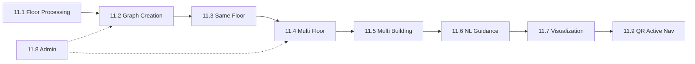

# Phase 11 — Indoor Navigation Module (Intelligent Faculty Routing)

**Status:** PLAN — awaiting approval  
**Created:** 2026-06-11  
**Parent system:** Student Faculty Assistant System (LECSTU)  
**Module scope:** Independent, scalable indoor navigation for 3 buildings × 9+ floors

---

## Context

The faculty has **three connected buildings**:

| Building | Code | Current floors | Future |
|----------|------|----------------|--------|
| Administration | `ADMIN` | Ground, First | More floors later |
| Academic | `ACAD` | Ground, First | More floors later |
| Laboratory | `LAB` | Ground, First | More floors later |

**Connections:**

- ADMIN ↔ ACAD (direct)
- ACAD ↔ LAB (direct)
- ADMIN ↔ LAB (must route through ACAD)

Phase 6B (6.4–6.9) delivered the **foundation**: floor plan upload, AI vision, markers, graph pathfinding, guided map, chatbot hooks.  
Phase 11 completes the **intelligent navigation module** as an independent, production-ready feature aligned with the 7 functional requirement areas.

---

## Design Principles (unchanged across all sub-phases)

1. **Building-agnostic core** — Navigation logic never hard-codes building names; uses `MapBuilding.id`, `FloorPlan.floor`, and graph topology only.
2. **Floor-scalable** — Adding a floor = upload JPG + analyze + markers + vertical links; no routing code changes.
3. **Graph-first runtime** — Floor plan AI runs at admin time; student routing reads `NavNode` + `NavEdge` only.
4. **Module boundary** — All indoor nav APIs live under `/api/indoor-nav/*` and `server/src/modules/indoor-navigation/`; legacy `/api/map/*` kept as aliases.
5. **Progressive enhancement** — Rule-based directions first; AI polish optional via engine :8004.

---

## Master Tracker

| Sub-Phase | Title | Maps to requirement | Status |
|-----------|-------|---------------------|--------|
| **11.1** | Floor Plan Processing & Structured Location Storage | Phase 1 | ⚠️ Partial |
| **11.2** | Navigation Graph Creation & Validation | Phase 2 | ⚠️ Partial |
| **11.3** | Same-Floor Navigation | Phase 3 | ⚠️ Partial |
| **11.4** | Multi-Floor Navigation | Phase 4 | ⬜ |
| **11.5** | Multi-Building Navigation | Phase 5 | ⬜ |
| **11.6** | Natural Language Guidance (Unified Pipeline) | Phase 6 | ⚠️ Partial |
| **11.7** | Route Visualization on Floor Plans | Phase 7 | ⚠️ Partial |
| **11.8** | Admin Consolidation & Publish Workflow | Cross-cutting | ⬜ |
| **11.9** | Active Navigation & QR Positioning | Future-ready | ⬜ |

**Legend:** ✅ Done · ⚠️ Partial · ⬜ Not started

---

## Sub-Phase 11.1 — Floor Plan Processing & Structured Location Storage

**Requirement:** Analyze uploaded floor plans; detect rooms, halls, labs, offices, corridors, stairs, elevators, entrances, exits, building connection points; store in structured format.

**Current state:** Upload, vision (8003/8004), auto markers, drawable region — done. Gaps: building connection points, QA review, engine graph import.

### Steps

| Step | Task | Deliverable |
|------|------|-------------|
| 11.1.1 | Register 3 faculty buildings with correct codes (`ADMIN`, `ACAD`, `LAB`) and floor metadata | `MapBuilding` rows + `facultyBuildings.ts` constants |
| 11.1.2 | Upload Ground + First floor JPG for each building (6 floor plans minimum) | `FloorPlan` records with image paths |
| 11.1.3 | Calibrate each floor plan: `bounds`, `drawableRegion`, `scaleMetersPerUnit` | Accurate overlay on map |
| 11.1.4 | Run AI analyze per floor (`analyze-ai` on upload or manual) | Auto `MapMarker` + corridor spine |
| 11.1.5 | Extend location types: mark **building connection points** as `ENTRANCE`/`EXIT` nodes on ACAD↔ADMIN and ACAD↔LAB doorways | Connection markers on correct floors |
| 11.1.6 | Admin review screen: list auto-detected locations; approve / edit / delete before publish | QA checklist per floor |
| 11.1.7 | Link markers to real entities (`LectureHall`, `LecturerOffice`, labs) | `MapMarker.entityId` populated |
| 11.1.8 | Document floor-add procedure (no code change): upload → analyze → review → publish | `docs/indoor-navigation/ADD-FLOOR.md` |

**Checkpoint:** All 6 current floors have reviewed markers including entrances, stairs, lifts, and inter-building connection points.

---

## Sub-Phase 11.2 — Navigation Graph Creation & Validation

**Requirement:** Graph model with nodes (rooms, halls, labs, offices, stairs, elevators, corridor junctions, building connections) and edges (walkable paths with distance, building ID, floor ID, direction).

**Current state:** `NavNode`/`NavEdge` schema, A*, admin editor (orphaned), auto spine from vision — partial.

### Steps

| Step | Task | Deliverable |
|------|------|-------------|
| 11.2.1 | Sync `MapMarker` → `NavNode` for all approved markers (`syncNavNodesFromMarkers`) | Room/entrance nodes on every floor |
| 11.2.2 | Add **corridor junction** nodes at hallway intersections (manual or AI spine) | `CORRIDOR` type nodes |
| 11.2.3 | Place **STAIRS** and **LIFT** nodes on each floor where vertical movement exists | Typed nodes per floor |
| 11.2.4 | Connect walkable edges along corridors (bidirectional, weight = pixel/Euclidean distance) | `NavEdge` within each floor |
| 11.2.5 | Attach edge metadata: `buildingId`, `floor`, implied direction (computed at route time) | Edge records validated |
| 11.2.6 | Import or merge Python engine `nodes`/`edges` from analyze response into DB (reduce duplicate spine logic) | Single source of truth |
| 11.2.7 | Graph validation script: orphan nodes, disconnected components, missing entrance | Admin validation report |
| 11.2.8 | Test route between two rooms on same floor in admin editor | Preview polyline works |

**Checkpoint:** Every floor has a connected graph; no orphan rooms; stairs/lifts exist as nodes.

---

## Sub-Phase 11.3 — Same-Floor Navigation

**Requirement:** Routes between any two locations on the same floor with step-by-step instructions.

**Current state:** A* + `buildTurnByTurnSteps` work within one building; UX split between story (`/navigate`) and graph (`/map/guide`).

### Steps

| Step | Task | Deliverable |
|------|------|-------------|
| 11.3.1 | Resolve start/end: marker ID, hall ID, office ID, or NL query → `NavNode` | `parseSourceDestinationQuery` + search |
| 11.3.2 | Run A* (Dijkstra fallback) on single-floor subgraph | `pathNodeIds[]`, `polyline[]` |
| 11.3.3 | Generate turn-by-turn steps: exit room → walk straight → turn left/right → destination | `steps[]` with action verbs |
| 11.3.4 | Compute `distanceMeters` and `estimatedMinutes` from scale | Metrics in API response |
| 11.3.5 | API: `POST /api/indoor-nav/route` and `GET /api/map/indoor-route` return identical geometry | Unified response shape |
| 11.3.6 | Handle edge cases: same room, blocked graph, missing marker | Clear error messages + admin fix links |
| 11.3.7 | Integration test: Lecture Hall A → Lecture Hall B (same floor, each building) | 3 buildings × 1 test route |

**Checkpoint:** Same-floor routing works for all buildings with human-readable steps.

---

## Sub-Phase 11.4 — Multi-Floor Navigation

**Requirement:** Routes across floors within one building (e.g. Ground → First).

**Current state:** Cross-floor edges allowed with +5 penalty; no admin workflow to pair STAIRS/LIFT across floors.

### Steps

| Step | Task | Deliverable |
|------|------|-------------|
| 11.4.1 | **Vertical connector wizard** (admin): select STAIRS/LIFT on floor N, pair with matching node on floor N±1 | Paired vertical edges |
| 11.4.2 | Create bidirectional `NavEdge` between paired stairs/lift nodes; label edge (`stairs`, `lift`) | Cross-floor edges in DB |
| 11.4.3 | Extend pathfinding: prefer labeled vertical edges; apply floor-change penalty | Correct multi-floor paths |
| 11.4.4 | Turn-by-turn: "Walk to staircase" → "Go up one floor" → "Exit staircase" → continue | Floor transition steps |
| 11.4.5 | Route response: `segments[]` per floor with `floor`, `buildingId`, `polyline` | Multi-segment payload |
| 11.4.6 | UI floor switcher: auto-switch floor when step crosses boundary | Guided map behavior |
| 11.4.7 | Test: Ground floor entrance → First floor room (each building) | 3 vertical route tests |

**Checkpoint:** Any two floors within one building route correctly with floor transition instructions.

---

## Sub-Phase 11.5 — Multi-Building Navigation

**Requirement:** Routes between buildings; ADMIN ↔ LAB must pass through ACAD.

**Current state:** Single-building routes only; `hasCrossBuilding` flag exists but no chained routing.

### Steps

| Step | Task | Deliverable |
|------|------|-------------|
| 11.5.1 | Define **campus connector model**: outdoor waypoints OR indoor exit→enter pairs at building boundaries | `CampusConnector` config (JSON or DB table) |
| 11.5.2 | Mark ACAD↔ADMIN and ACAD↔LAB connection points as paired `ENTRANCE`/`EXIT` nodes | 4 connection node pairs minimum |
| 11.5.3 | Implement **multi-leg router**: decompose ADMIN→LAB into ADMIN→ACAD + ACAD→LAB | `legs[]` in route response |
| 11.5.4 | Enforce topology: reject direct ADMIN→LAB edge; only ACAD as intermediary | Routing constraint |
| 11.5.5 | Turn-by-turn across buildings: "Exit Administration Building" → "Enter Academic Building" → … → "Enter Laboratory Building" | Building transition steps |
| 11.5.6 | Optional outdoor segment on campus Leaflet map between building exits | Outdoor polyline (lat/lng) |
| 11.5.7 | Chained timetable routes: class in ADMIN then LAB → full day route | `/map/indoor-route/today` multi-building |
| 11.5.8 | Test: Administration office → Laboratory (via Academic) | End-to-end cross-building route |

**Checkpoint:** Any two locations in the faculty complex route correctly, respecting building topology.

---

## Sub-Phase 11.6 — Natural Language Guidance (Unified Pipeline)

**Requirement:** Human-friendly instructions for all route types; support chatbot and voice.

**Current state:** Three tiers (story, rule-based, AI) not unified; story returns empty polyline.

### Steps

| Step | Task | Deliverable |
|------|------|-------------|
| 11.6.1 | Single NL entry point: `POST /api/indoor-nav/navigation` and `/api/navigation/query` share logic | One query pipeline |
| 11.6.2 | Intent detection: "Take me to X", "From A to B", "Guide me to next class" | `navigationIntentService` |
| 11.6.3 | Entity resolution: room names, halls, lecturers, buildings → `NavNode` | `mapSearchService` |
| 11.6.4 | Always attach `polyline` + `steps` when graph exists; story text as supplement only | Unified response |
| 11.6.5 | Standardize step vocabulary: walk straight, turn left/right, enter corridor, use staircase, go up/down N floors, enter {building}, destination reached | Step template library |
| 11.6.6 | Optional AI polish via engine :8004 `/directions/generate` (graceful fallback) | Enhanced wording |
| 11.6.7 | Chatbot actions: `ActionGuideToRoom`, `ActionGuideToNextClass` use unified API | Rasa actions updated |
| 11.6.8 | Voice: ASR transcript → same NL pipeline | Voice indoor queries work |

**Checkpoint:** One query path produces consistent steps + map geometry for chatbot, voice, and web UI.

---

## Sub-Phase 11.7 — Route Visualization on Floor Plans

**Requirement:** Display start, destination, path, floor transitions, building transitions on floor plan.

**Current state:** `GuidedMap` has polyline; `SimpleIndoorGuide` is text-only; editors orphaned.

### Steps

| Step | Task | Deliverable |
|------|------|-------------|
| 11.7.1 | Merge map layer into primary student page (`/navigate` / `SimpleIndoorGuide`) | Floor plan + route overlay |
| 11.7.2 | Draw start pin (green), destination pin (red), path polyline (highlight color) | SVG overlay on JPG |
| 11.7.3 | Floor switcher: tabs or dropdown per `segments[].floor` | Multi-floor UI |
| 11.7.4 | Building transition banner between legs | "Now entering Academic Building" |
| 11.7.5 | Step list synced with map: highlight current step | Previous / Next navigation |
| 11.7.6 | Deep links: `/map/guide?buildingId=&toHallId=` and chatbot links | Shareable URLs |
| 11.7.7 | Mobile: responsive floor plan, pinch zoom, bottom sheet for steps | Phone-friendly UX |
| 11.7.8 | Today mode: tab per class with chained multi-building visualization | Timetable integration |

**Checkpoint:** Student sees full route on floor plan with steps, floor switches, and building transitions.

---

## Sub-Phase 11.8 — Admin Consolidation & Publish Workflow

**Cross-cutting:** Makes the module operable without developer intervention.

### Steps

| Step | Task | Deliverable |
|------|------|-------------|
| 11.8.1 | Re-mount admin tools in `/admin/navigation`: Setup \| Markers \| Walking Paths \| Vertical Links | Tabbed admin UI |
| 11.8.2 | Wire `IndoorMarkerEditor`, `IndoorNavGraphEditor` routes | Orphaned pages accessible |
| 11.8.3 | Per-floor **publish status**: draft → reviewed → published (students see published only) | `FloorPlan.status` or flag |
| 11.8.4 | Health dashboard: vision engine 8003, nav engine 8004, graph connectivity | Admin status panel |
| 11.8.5 | Seed / migration script for 3 buildings × 2 floors demo data | Reproducible setup |

**Checkpoint:** Admin can set up a new floor end-to-end without touching code.

---

## Sub-Phase 11.9 — Active Navigation & QR Positioning (Future-Ready)

**Not blocking Phases 11.1–11.7; prepares for live "you are here".**

### Steps

| Step | Task | Deliverable |
|------|------|-------------|
| 11.9.1 | Re-enable `QrScanPage` at `/navigate/scan` or `/map/scan` | QR scan UI routed |
| 11.9.2 | QR scan → `POST /api/indoor-nav/position/qr` → update session `currentNodeId` | Position anchored |
| 11.9.3 | Re-route from scanned position to destination | Dynamic route update |
| 11.9.4 | Step index advances on floor change / QR rescan | Progress tracking |
| 11.9.5 | Stub `BLE_BEACON` / `UWB` providers behind `PositionProvider` interface | Extensibility only |

**Checkpoint:** QR-based "you are here" with rerouting works on one test floor.

---

## Recommended Execution Order

**Parallel tracks:**

- **11.8** (admin) can start alongside **11.2**
- **11.6** and **11.7** can overlap once **11.3** is stable
- **11.9** is last

---

## Dependency on Phase 6B

| 6B Sub-Phase | Phase 11 reuse |
|--------------|----------------|
| 6.4 Floor plan pipeline | 11.1 extends with connection points + QA |
| 6.4b AI vision | 11.1.4, 11.2.6 engine import |
| 6.5 Marker placement | 11.1.7, 11.8.2 |
| 6.6 Nav graph | 11.2, 11.3 foundation |
| 6.7 Today schedule | 11.5.7, 11.7.8 |
| 6.8 Route API + GuidedMap | 11.3, 11.7 base |
| 6.9 Chatbot | 11.6.7 |

---

## Estimated Effort

| Sub-Phase | Effort |
|-----------|--------|
| 11.1 | ~2 days |
| 11.2 | ~2 days |
| 11.3 | ~1 day |
| 11.4 | ~2 days |
| 11.5 | ~3 days |
| 11.6 | ~1.5 days |
| 11.7 | ~2 days |
| 11.8 | ~1.5 days |
| 11.9 | ~2 days |
| **Total** | **~17 days** |

---

## Approval Checklist

Before starting implementation, confirm:

- [ ] Sub-phase breakdown matches your expectations
- [ ] 9 sub-phases (11.1–11.9) vs consolidating 11.8/11.9
- [ ] Priority order: 11.1 → 11.2 → 11.3 first (same-floor MVP)
- [ ] Multi-building outdoor segment: required in 11.5 or indoor-only first?
- [ ] Publish workflow (11.8.3): needed now or later?

---

*Awaiting approval to begin Sub-Phase 11.1.*
