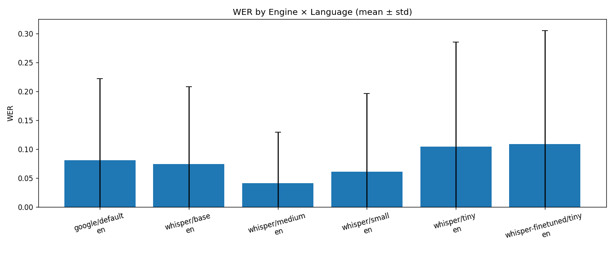
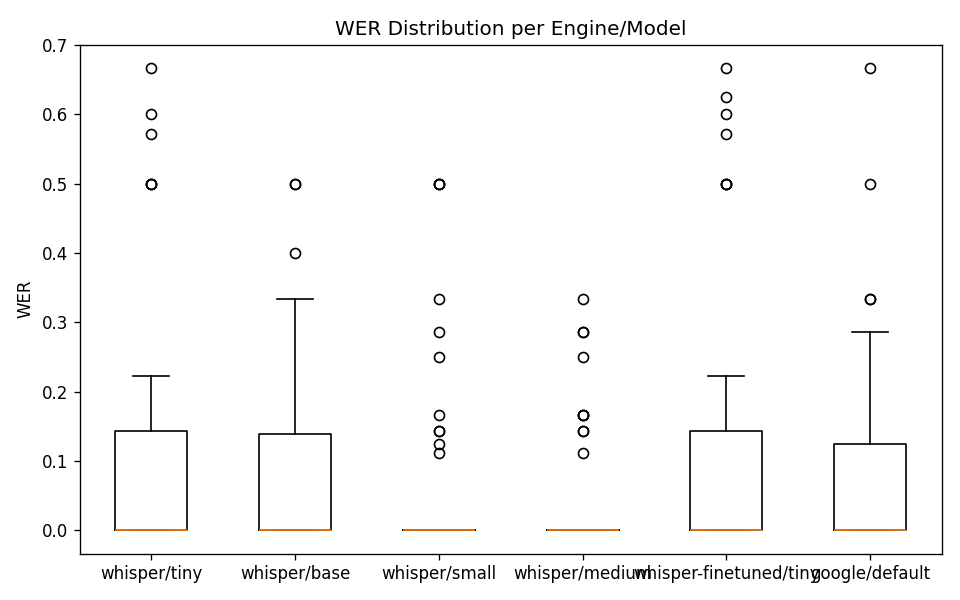
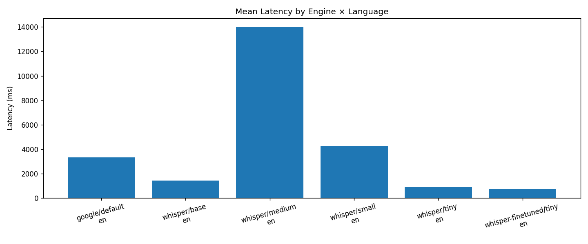
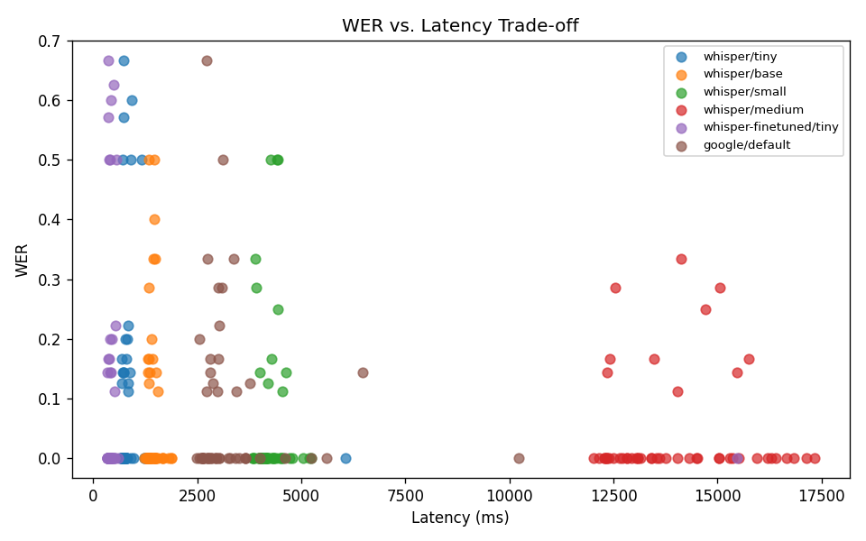

# ASR Benchmark Report (Phase 7.4)

**Research Objective (RO-1)**: Develop and evaluate an ASR pipeline supporting English, Tamil, and Sinhala for academic voice queries.

**Research Question (RQ-1)**: How does Whisper compare to Google Speech API in terms of WER and latency for multilingual academic queries?

**Hypothesis (H1)**: Whisper (medium) achieves lower WER than Google Speech API for Tamil and Sinhala academic queries.

**Experiment ID**: 20260310_052801
**Timestamp**: 2026-03-10T05:48:45.812284Z

---

## 1. Introduction

This report presents the statistical analysis of the LECSTU ASR benchmark experiments. The benchmark compares OpenAI Whisper (models: tiny, base, small, medium), Google Cloud Speech-to-Text, and Azure Speech Services on a dataset of 150 academic domain utterances in English, Tamil, and Sinhala.

---

## 2. Methodology

### 2.1 Dataset
- **Utterances**: 50 per language (en, ta, si) = 150 total
- **Categories**: Timetable, Halls, Appointments, Directions, General
- **Format**: 16 kHz WAV mono
- **Ground truth**: Manual transcription, double-verified

### 2.2 Experiment Config
- **Utterances used**: 50
- **Configurations**: 7
- **Runs per config**: 1

### 2.3 Metrics
- **WER** (Word Error Rate): (S+I+D) / reference length
- **CER** (Character Error Rate): Edit distance at character level
- **Latency**: End-to-end transcription time (ms)

---

## 3. Results

### 3.1 Data Summary
- Total transcriptions: 350
- Valid (no error): 300
- Failed: 50
- *Note: Some transcriptions failed (e.g., ffmpeg not found). Install ffmpeg and re-run benchmark for full results.*

### 3.2 WER by Configuration (mean ± std)

| Configuration | Mean | Median | Std | Min | Max | N |
|---------------|------|--------|-----|-----|-----|---|
| google_default_en | 0.0806 | 0.0 | 0.1421 | 0.0 | 0.6667 | 50 |
| whisper-finetuned_tiny_en | 0.1092 | 0.0 | 0.1967 | 0.0 | 0.6667 | 50 |
| whisper_base_en | 0.0743 | 0.0 | 0.1342 | 0.0 | 0.5 | 50 |
| whisper_medium_en | 0.041 | 0.0 | 0.0882 | 0.0 | 0.3333 | 50 |
| whisper_small_en | 0.0612 | 0.0 | 0.1353 | 0.0 | 0.5 | 50 |
| whisper_tiny_en | 0.1045 | 0.0 | 0.1814 | 0.0 | 0.6667 | 50 |

### 3.3 Latency by Configuration (ms)

| Configuration | Mean | Median | Std | N |
|---------------|------|--------|-----|---|
| google_default_en | 3331.132 | 2960.3 | 1258.6028 | 50 |
| whisper-finetuned_tiny_en | 717.878 | 402.75 | 2107.3726 | 50 |
| whisper_base_en | 1436.778 | 1400.3 | 147.4116 | 50 |
| whisper_medium_en | 14018.39 | 13564.35 | 1530.0273 | 50 |
| whisper_small_en | 4264.722 | 4188.3 | 324.3095 | 50 |
| whisper_tiny_en | 899.31 | 756.9 | 748.2504 | 50 |

---

## 4. Statistical Analysis

### 4.1 Inferential Tests (Whisper medium vs. Google)

| Language | p-value | Test Statistic | Cohen's d | 95% CI (diff) | Significant? |
|----------|---------|----------------|-----------|----------------|---------------|
| en | 0.0678 | 38.0 | -0.3345 | (-0.0782, -0.0009) | No |
| ta | None | None | None | N/A | N/A |
| si | None | None | None | N/A | N/A |

---

## 5. Visualizations

- 

- 

- 

- 

---

## 6. Discussion

### 6.1 Key Findings
- Analysis based on available valid transcriptions.
- Full comparison requires running the complete benchmark (150 utterances × 5 Whisper configs + Google × 3 runs).
### 6.2 Limitations
- Sample/placeholder audio may not reflect real-world WER.
- Replace with recorded human speech for final evaluation.

---

## 7. Conclusion

**Hypothesis H1**: *PENDING* — Run full benchmark and inferential tests with complete data to accept or reject.

---

## 8. Artifacts

| File | Description |
|------|-------------|
| asr-benchmark/results/asr_benchmark_20260310_052801.json | Raw benchmark results |
| ../asr-benchmark/results/wer_by_config.png | Visualization |
| ../asr-benchmark/results/wer_boxplot.png | Visualization |
| ../asr-benchmark/results/latency_by_config.png | Visualization |
| ../asr-benchmark/results/wer_vs_latency.png | Visualization |

*Generated by LECSTU ASR Benchmark Analysis (Phase 7.4)*