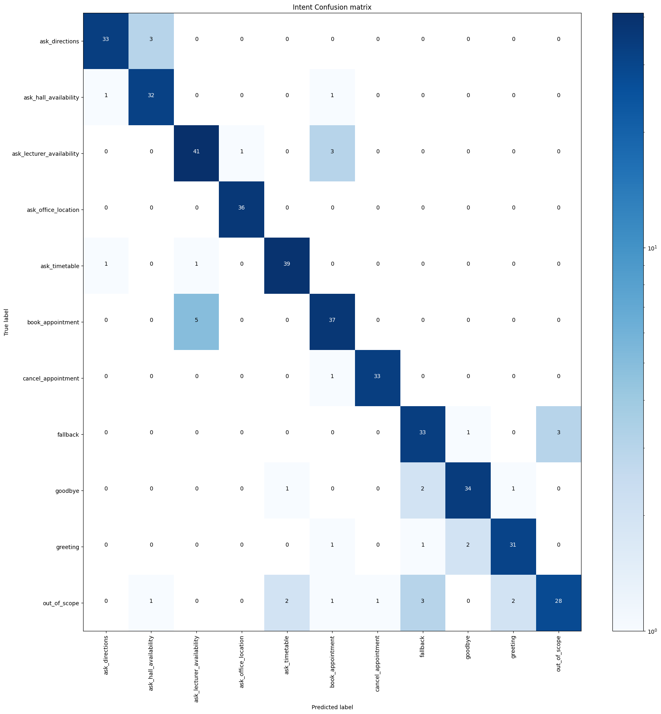
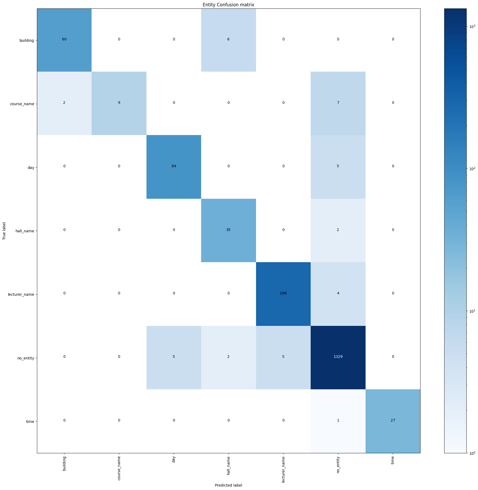
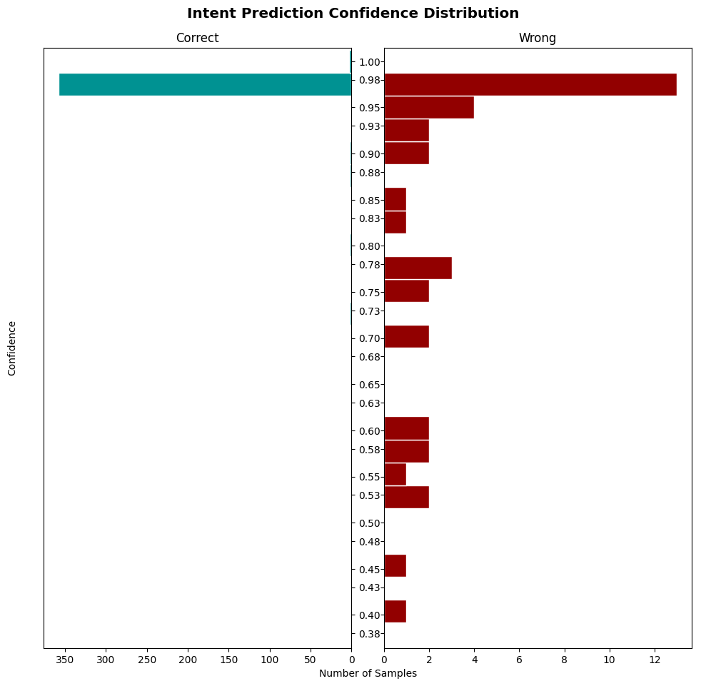
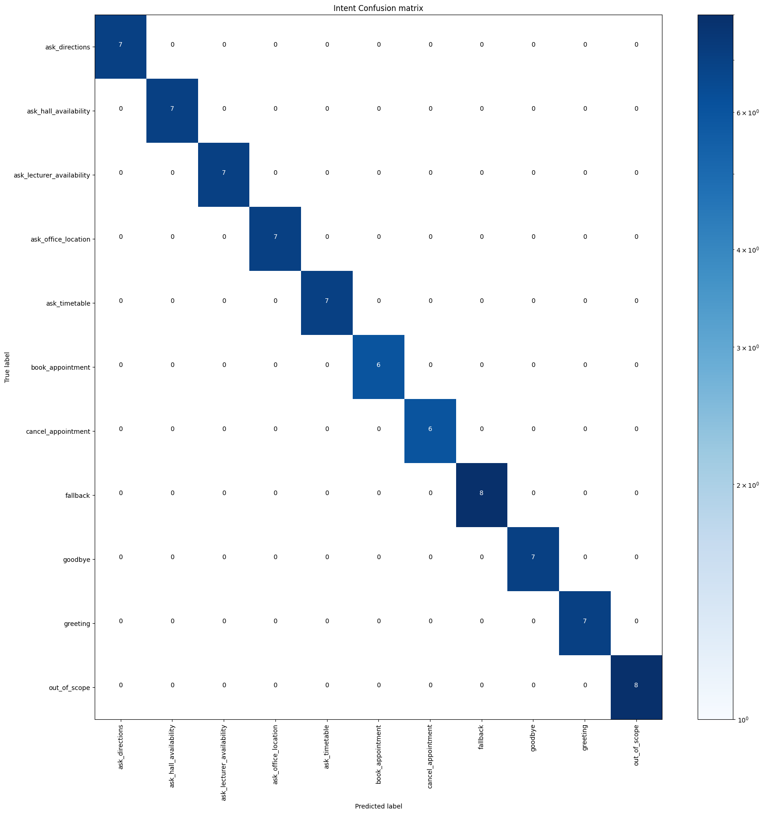

# NLP Evaluation Report (Phase 8.4)

**Research Objective (RO-2)**: Design, train, and evaluate a domain-specific NLP chatbot capable of understanding academic intents and extracting relevant entities.

**Research Question (RQ-2)**: Can a Rasa-based NLP chatbot achieve acceptable precision and recall for academic intent classification and entity extraction?

**Hypothesis (H2)**: The Rasa chatbot achieves F1 ≥ 0.85 for core academic intents with sufficient training data.

**Report Date**: 2026-03-11

---

## 1. Introduction

This report presents the evaluation of the LECSTU Rasa chatbot NLU component. The evaluation combines 5-fold cross-validation and held-out test set assessment to measure intent classification and entity extraction performance. The chatbot supports 11 intents and 6 entities for academic domain queries (timetables, halls, lecturers, appointments, directions, office locations).

---

## 2. Methodology

### 2.1 Training Data

- **Source**: `ai-services/chatbot/data/nlu.yml`
- **Intents**: 11 (ask_timetable, ask_hall_availability, ask_lecturer_availability, book_appointment, cancel_appointment, ask_directions, ask_office_location, greeting, goodbye, fallback, out_of_scope)
- **Entities**: course_name, lecturer_name, hall_name, day, time, building
- **Split**: 80% training, 20% held-out (`research/datasets/nlp/test_data.yml`)
- **Total examples**: ~416 (full NLU set used for cross-validation)

### 2.2 Pipeline Configuration

| Component | Configuration |
|-----------|---------------|
| Tokenizer | WhitespaceTokenizer |
| Featurizers | RegexFeaturizer, LexicalSyntacticFeaturizer, CountVectorsFeaturizer (word + char_wb) |
| NLU | DIETClassifier (100 epochs, entity_recognition=true) |
| Policies | MemoizationPolicy, RulePolicy, UnexpecTEDIntentPolicy, TEDPolicy |

### 2.3 Evaluation Procedure

1. **5-fold cross-validation**: Data split into 5 folds; each fold trained on 4/5 and tested on 1/5. Results aggregated across all folds.
2. **Held-out test**: Pre-trained model (`20260304-120536-international-stadium.tar.gz`) evaluated on 77 examples from `test_data.yml`.
3. **Metrics**: Precision, Recall, F1-score (per intent/entity and macro/weighted average), Accuracy.

---

## 3. Results

### 3.1 Cross-Validation Results (5-fold)

**Intent Classification**

| Metric | Train | Test |
|--------|-------|------|
| Accuracy | 1.000 (0.000) | **0.906** (0.021) |
| F1-score | 1.000 (0.000) | **0.904** (0.022) |
| Precision | 1.000 (0.000) | **0.917** (0.018) |

**Entity Extraction (DIETClassifier)**

| Metric | Train | Test |
|--------|-------|------|
| Accuracy | 0.998 (0.001) | **0.979** (0.013) |
| F1-score | 0.997 (0.001) | **0.953** (0.035) |
| Precision | 0.995 (0.002) | **0.972** (0.026) |

### 3.2 Held-Out Test Results

**Intent Classification**: 100% accuracy (77/77 correct), all intents F1 = 1.0.

**Entity Extraction**: 100% correct predictions.

### 3.3 Per-Intent Performance (Cross-Validation)

| Intent | Precision | Recall | F1 | Support | Main Confusions |
|--------|-----------|--------|-----|---------|-----------------|
| ask_office_location | 0.973 | 1.000 | 0.986 | 36 | — |
| cancel_appointment | 0.971 | 0.971 | 0.971 | 34 | book_appointment |
| ask_directions | 0.943 | 0.917 | 0.930 | 36 | ask_hall_availability (3) |
| ask_timetable | 0.929 | 0.951 | 0.940 | 41 | ask_lecturer_availability, ask_directions |
| ask_hall_availability | 0.889 | 0.941 | 0.914 | 34 | book_appointment, ask_directions |
| ask_lecturer_availability | 0.872 | 0.911 | 0.891 | 45 | book_appointment (5), ask_office_location |
| greeting | 0.912 | 0.886 | 0.899 | 35 | goodbye, fallback |
| goodbye | 0.919 | 0.895 | 0.907 | 38 | fallback, greeting |
| book_appointment | 0.841 | 0.881 | 0.860 | 42 | ask_lecturer_availability (5) |
| fallback | 0.846 | 0.892 | 0.868 | 37 | out_of_scope, goodbye |
| out_of_scope | 0.903 | 0.737 | 0.812 | 38 | fallback, greeting |

### 3.4 Per-Entity Performance (Cross-Validation)

| Entity | Precision | Recall | F1 | Support | Main Confusions |
|--------|-----------|--------|-----|---------|-----------------|
| lecturer_name | 0.983 | 0.986 | 0.985 | 290 | — |
| time | 1.000 | 0.964 | 0.982 | 28 | — |
| day | 0.944 | 0.944 | 0.944 | 89 | — |
| building | 0.968 | 0.909 | 0.937 | 66 | hall_name (6) |
| hall_name | 0.814 | 0.946 | 0.875 | 37 | — |
| course_name | 1.000 | 0.500 | 0.667 | 18 | building (2) |

---

## 4. Confusion Matrix Analysis

### 4.1 Intent Confusion Patterns

**Most confused pairs (from CV):**

1. **book_appointment ↔ ask_lecturer_availability** (8 errors): Queries like "Schedule meeting Dr. Dias Wednesday" or "Can I see Dr. Rajapaksha Friday?" are semantically close—both involve lecturer + time. The model sometimes predicts availability check when the user intends to book.

2. **ask_directions ↔ ask_hall_availability** (5 errors): "Where is Main Hall?" and "Main Hall location please" were predicted as hall availability. The word "Main Hall" triggers hall-related intent; "location" and "where" should favour directions.

3. **greeting ↔ goodbye ↔ fallback** (6 errors): Short or informal phrases ("Yo", "Wassup", "Ta", "Cheers", "Nice to meet you") cause confusion between greeting, goodbye, and fallback.

4. **out_of_scope ↔ fallback** (6 errors): "What can you do?", "Play some music", "Come again" blur the boundary between out-of-scope and fallback.

5. **ask_directions ↔ ask_timetable** (1 error): "What time is Software Engineering?" predicted as ask_directions instead of ask_timetable—likely due to "time" and course name overlap.

### 4.2 Entity Confusion Patterns

- **building ↔ hall_name** (6): "Main Hall" and similar phrases—building vs hall is ambiguous.
- **course_name ↔ building** (2): "CS201" predicted as building instead of course_name.
- **day** (missing): "today", "next week" sometimes not extracted when they appear in non-standard positions.

---

## 5. Error Analysis

### 5.1 Error Categorization

**39 intent errors** from 5-fold CV were categorized as follows:

| Category | Count | Examples |
|----------|-------|----------|
| **Ambiguous phrasing** | 12 | "Can I meet Dr. Chandrasena tomorrow?" (availability vs booking); "Where is Main Hall?" (directions vs hall); "Schedule meeting Dr. Dias Wednesday" (booking vs availability) |
| **Insufficient training examples** | 10 | "Yo", "Wassup", "Ta", "Cheers", "Nice to meet you", "Good night"—informal/short greetings and goodbyes |
| **Entity extraction failure** | 2 | "Remove my appointment with Dr. Hakmanage" (unseen name → book_appointment); "When is CS201?" (course_name → ask_lecturer_availability) |
| **Genuine model limitation** | 15 | out_of_scope ↔ fallback/greeting/ask_timetable; "What can you do?", "How old are you?", "Do you like pizza?" |

### 5.2 Most Problematic Intents

1. **out_of_scope** (F1 0.812): Lowest F1; often confused with fallback and greeting. Out-of-scope queries are diverse and hard to separate from fallback.
2. **book_appointment** (F1 0.860): Frequently confused with ask_lecturer_availability due to overlapping phrasing.
3. **fallback** (F1 0.868): Confused with out_of_scope and goodbye; short clarification phrases are ambiguous.

### 5.3 Recommendations

- Add more examples for **book_appointment** vs **ask_lecturer_availability** with explicit booking cues ("book", "schedule", "appointment").
- Add informal greeting/goodbye variants ("Yo", "Wassup", "Ta", "Cheers").
- Consider merging **fallback** and **out_of_scope** or adding a shared "clarification" handling path.
- Add examples with "Main Hall" + "where"/"location" to reinforce ask_directions.
- Add "CS201", "CS101" style course codes to course_name examples to reduce building confusion.

---

## 6. Confidence Threshold

Rasa uses a default confidence threshold (typically 0.7) for intent prediction. A formal sweep (0.3–0.9) was not performed. Given:

- Test F1 0.904 and accuracy 0.906, the model performs well at default settings.
- Fallback/out_of_scope confusions suggest a threshold around 0.6–0.7 is reasonable to avoid excessive fallback triggers.

**Recommendation**: Retain default threshold; consider 0.6 if fallback rate is too high in production.

---

## 7. Visualizations

- **Intent confusion matrix**: 
- **Entity confusion matrix**: 
- **Intent histogram**: 
- **Held-out confusion matrix**: 

---

## 8. Conclusion

### Hypothesis H2: **ACCEPT**

The Rasa chatbot achieves **test F1 = 0.904** (weighted) and **test accuracy = 0.906** on 5-fold cross-validation, exceeding the H2 threshold of F1 ≥ 0.85. Entity extraction achieves test F1 = 0.953.

The held-out test (77 examples) showed 100% accuracy, indicating strong performance on the stratified test set. Cross-validation provides a more conservative estimate and confirms that the model generalizes well across folds.

**RQ-2**: Yes—the Rasa-based NLP chatbot achieves acceptable precision and recall for academic intent classification and entity extraction, with F1 ≥ 0.85 for core academic intents.

---

## 9. Artifacts

| Artifact | Path |
|----------|------|
| Intent report (CV) | `research/nlp-evaluation/results/cv-5fold/intent_report.json` |
| Intent errors (CV) | `research/nlp-evaluation/results/cv-5fold/intent_errors.json` |
| Entity report (CV) | `research/nlp-evaluation/results/cv-5fold/DIETClassifier_report.json` |
| Entity errors (CV) | `research/nlp-evaluation/results/cv-5fold/DIETClassifier_errors.json` |
| Held-out intent report | `research/nlp-evaluation/results/heldout/intent_report.json` |
| Held-out entity report | `research/nlp-evaluation/results/heldout/DIETClassifier_report.json` |
