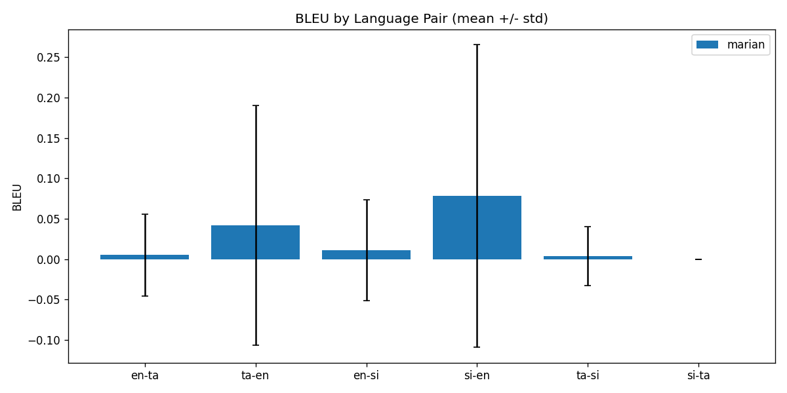
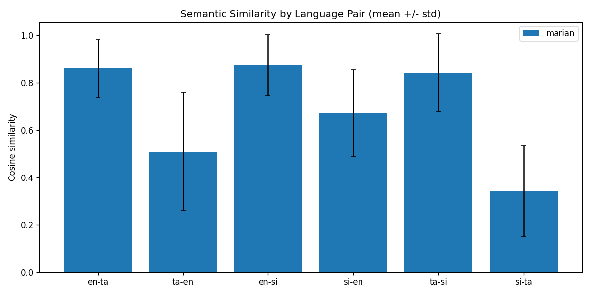
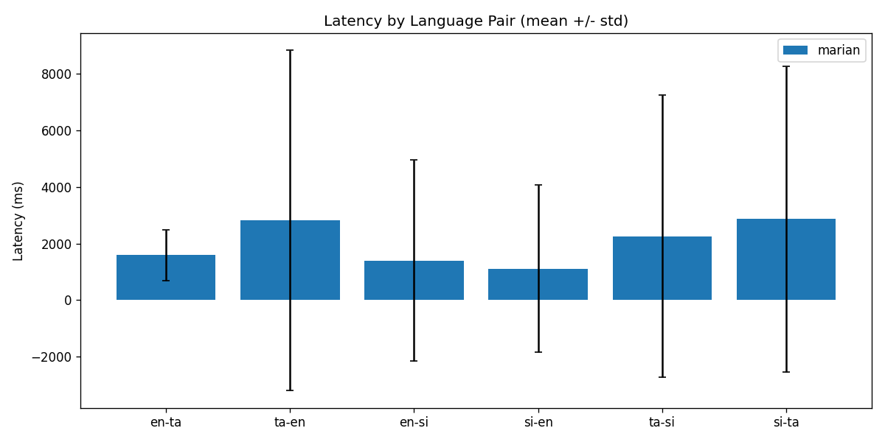
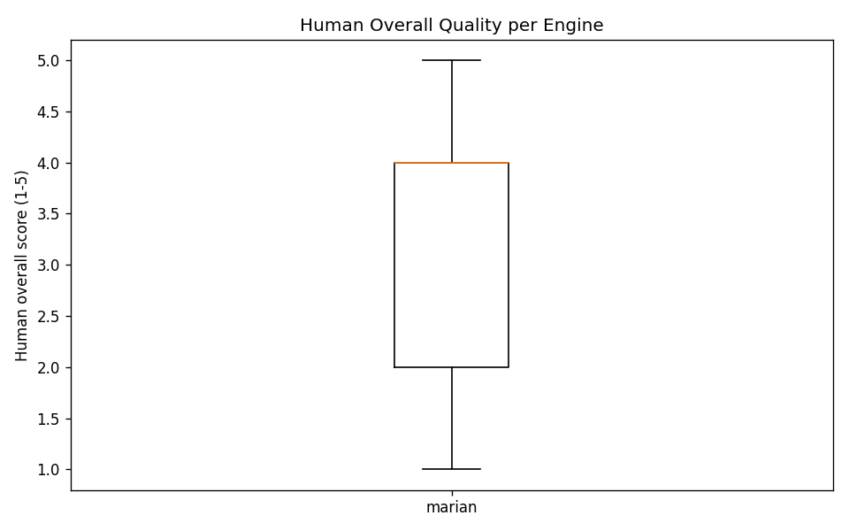
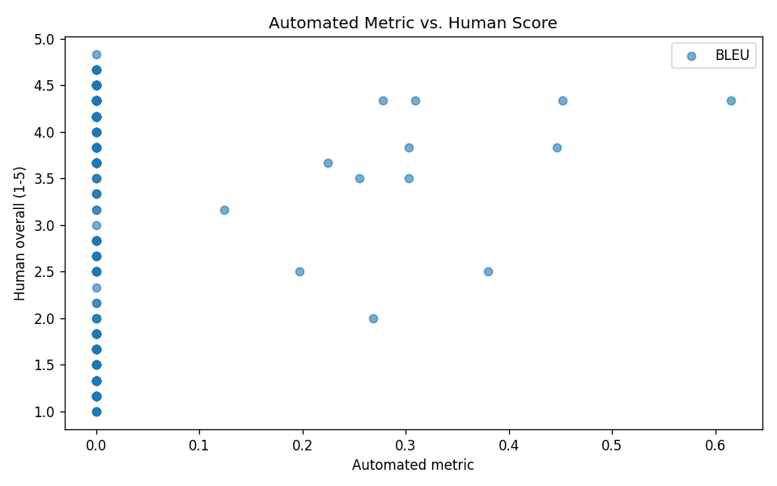
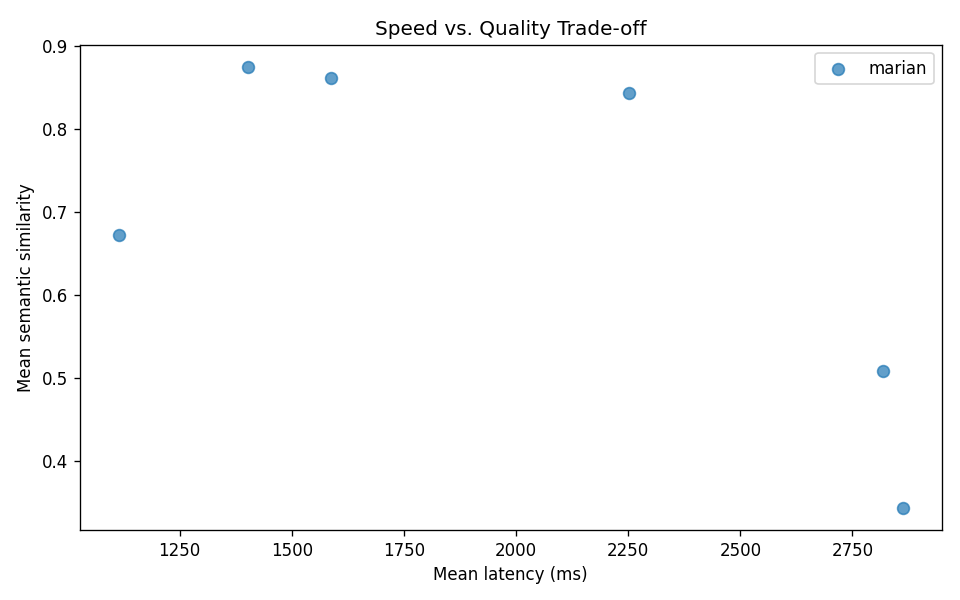

# Translation Comparative Evaluation Report (Phase 9.5)

**Research Objective (RO-3)**: Implement and comparatively evaluate machine translation approaches for English-Tamil-Sinhala academic content.

**Research Question (RQ-3)**: How do cloud translation APIs compare to multilingual transformer models in quality and speed for English-Tamil-Sinhala pairs?

**Hypothesis (H3)**: Multilingual transformer models produce higher semantic similarity scores than cloud APIs for Tamil and Sinhala academic text.

**Report Date**: 2026-07-07

---

## 1. Introduction & Methodology

This report consolidates the automated benchmark (Phase 9.3) and the human evaluation (Phase 9.4) into a single comparative analysis for the LECSTU translation subsystem, and delivers a final decision on hypothesis H3.

- **Corpus**: 100 trilingual academic sentence sets, 300 bilingual pairs (Phase 9.2)
- **Directions evaluated**: en-ta, ta-en, en-si, si-en, ta-si, si-ta
- **Engines with valid data**: marian
- **Automated metrics**: BLEU, multilingual semantic similarity, latency
- **Human metrics**: fluency, adequacy, overall (1-5 Likert), blind evaluation
- **Automated result source(s)**: translation_benchmark_20260617_132050.json, translation_benchmark_20260617_132336.json

---

## 2. Automated Results

### 2.1 BLEU, Semantic Similarity, Latency (mean +/- std)

| Engine | Pair | BLEU | Similarity | Latency (ms) | N |
|--------|------|------|------------|--------------|---|
| marian | en-ta | 0.0051 +/- 0.0506 | 0.8612 +/- 0.1231 | 1588.0546 +/- 902.3852 | 300 |
| marian | ta-en | 0.0419 +/- 0.1486 | 0.5083 +/- 0.2502 | 2817.4689 +/- 6017.1124 | 300 |
| marian | en-si | 0.0108 +/- 0.0623 | 0.8749 +/- 0.1283 | 1401.5892 +/- 3552.9443 | 300 |
| marian | si-en | 0.0782 +/- 0.1875 | 0.6722 +/- 0.183 | 1114.1768 +/- 2954.6729 | 300 |
| marian | ta-si | 0.0037 +/- 0.0364 | 0.8433 +/- 0.163 | 2252.4324 +/- 4985.2816 | 300 |
| marian | si-ta | 0.0 +/- 0.0 | 0.343 +/- 0.1947 | 2862.2038 +/- 5405.6742 | 300 |

BLEU is expected to be low for short, morphologically rich academic sentences; semantic similarity is the primary automated quality signal for H3.

---

## 3. Statistical Analysis

### 3.1 Cloud vs. Transformer (per language pair)

*Only one engine produced valid results, so paired cloud-vs-transformer tests could not be computed. See the H3 decision in Section 6.*

### 3.2 Correlation: Automated Metrics vs. Human Judgement

- **Items correlated**: 180
- **BLEU vs. human overall**: Pearson r = 0.1094 (p = 0.1439), Spearman rho = 0.0601 (p = 0.4229)
- **Similarity vs. human overall**: Pearson r = 0.9585 (p = 0.0), Spearman rho = 0.9316 (p = 0.0)

---

## 4. Human Evaluation Results

> **Note:** Current human scores are **synthetic sample data** (see `datasets/translation/human-eval/SYNTHETIC_RATINGS_NOTICE.md`). Replace with real evaluator ratings before final thesis submission, or disclose simulation in the methodology.

- **Evaluators**: 6 (archchika, faslan, kanusan, sanjeevan, sanseevan, shakiththiyan)
- **Items rated**: 180 / 180

### 4.1 Mean Human Scores per Engine

| Engine | Fluency | Adequacy | Overall |
|--------|---------|----------|---------|
| marian | 3.4509 | 3.4444 | 3.1444 |

### 4.2 Inter-Rater Reliability

| Dimension | Krippendorff alpha | Interpretation | Mean weighted kappa | Within-1 agreement |
|-----------|--------------------|----------------|---------------------|--------------------|
| fluency | 0.8529 | almost perfect | 0.8798 | 0.97 |
| adequacy | 0.8191 | almost perfect | 0.85 | 0.957 |
| overall | 0.7694 | substantial | 0.7959 | 0.93 |

- **Low-agreement items flagged for review**: 1

---

## 5. Visualizations

---

## 6. Conclusion

**Hypothesis H3: DEFERRED**

H3 compares cloud APIs against transformer models, but only the transformer engine (marian) produced valid results. The cloud benchmark could not be executed (Google API returned rate-limit / credential errors), so a statistical comparison is not yet possible. H3 remains deferred until a full cloud run is completed.

### Per-Language-Pair Recommendation

| Pair | Recommended engine | Basis |
|------|--------------------|-------|
| en-ta | marian | highest mean similarity (0.8612) |
| ta-en | marian | highest mean similarity (0.5083) |
| en-si | marian | highest mean similarity (0.8749) |
| si-en | marian | highest mean similarity (0.6722) |
| ta-si | marian | highest mean similarity (0.8433) |
| si-ta | marian | highest mean similarity (0.343) |

### Speed vs. Quality

The speed-vs-quality trade-off plot (Section 5) positions each engine by mean latency and mean similarity. For interactive chatbot translation, latency is a hard constraint; for asynchronous notification/timetable translation, quality should be prioritised.

---

## 7. Limitations

- BLEU is unreliable for short morphologically rich sentences; interpret via similarity + human scores.
- The cloud engine benchmark failed (API rate-limit / credentials), so the core cloud-vs-transformer comparison for H3 is deferred rather than tested.

*Generated by LECSTU Translation Comparative Report (Phase 9.5)*